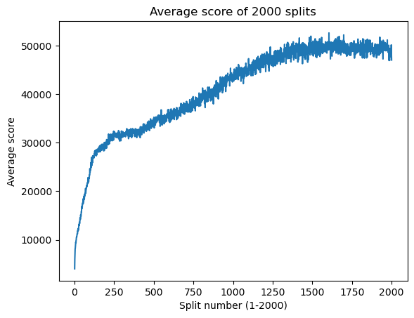
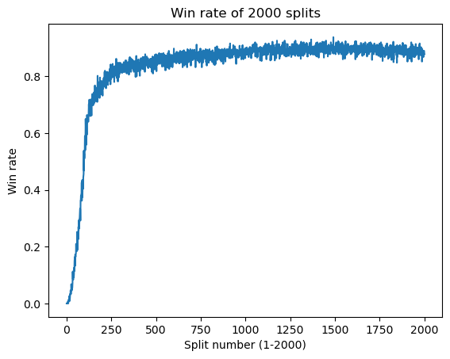
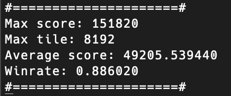

# N-tuple neural network written in x86 assembly

I originally wrote all of this (minus formatting etc.) in [this repository](https://github.com/alexyzha/ASM-Make/tree/main). The full commit history can be found here.

I have also written a `C++` version of this in [this repository](https://github.com/alexyzha/2048-Neural-Network), where most of the theory and code structure is explained. The code structure for the `ASM` (this) version is different.

I trained this neural network on my chad desktop instead of my virgin mac this time. I tracked the model's performance during training throughout chunks (splits) that consisted of `500` games each. I then used the average score and winrate of these splits to create graphics tracking the model's performance in different stages of training. The results are shown below:

There are `2000` splits since I trained the model across `1,000,000` games of `2048`. Testing consisted of `50,000` games, with a single average score and winrate across all `50,000` games. I also tracked the highest tile made and the highest total score. The results of a single testing run (different seed) is shown below:

